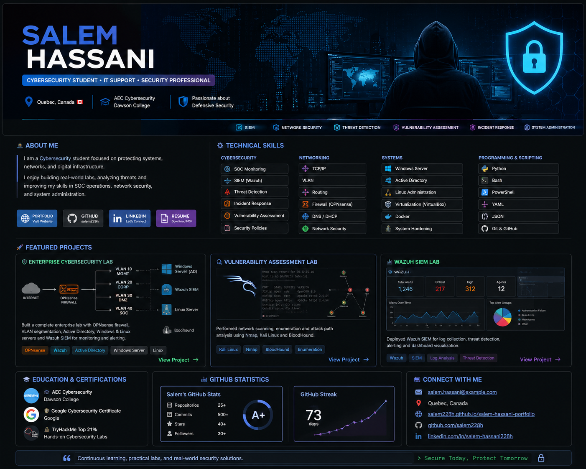

# 👋 Hi, I'm Salem Hassani

### 💻 IT Support Specialist | Aspiring Cybersecurity Professional

🇨🇦 Montreal, Canada
  

---

## 👨‍💻 About Me

I'm an IT professional based in Quebec, currently seeking an **entry-level IT Support role** while continuing to build my skills in cybersecurity. I recently completed my **AEC in Cybersecurity at Dawson College**, and I bring hands-on experience with system administration, networking, and troubleshooting — with a growing specialization in defensive security.

**Current focus:**
- 🖥️ IT Support & System Administration
- 🌐 Networking Fundamentals
- 🔐 Security Monitoring (SOC basics)
- 🛡️ Defensive Security & Vulnerability Assessment

---

## 🚀 Featured Projects

### 🛡️ Enterprise Cybersecurity Lab
A complete home-lab security environment built to practice enterprise-style network defense:
- OPNsense Firewall
- VLAN Network Segmentation
- Active Directory & Windows Server
- Linux Servers
- Wazuh SIEM Monitoring

**Skills demonstrated:** Firewall Management • Network Security • Access Control • Security Monitoring

### 🔎 Vulnerability Assessment Lab
A testing environment for practicing security assessment workflows:
- Kali Linux
- Nmap
- BloodHound
- Vulnerability Scanning & Analysis

---

## 🧰 Technical Skills

**IT Support & Systems**

**Cybersecurity**

**Tools**

---

## 🎓 Education & Certifications

- 🎓 AEC Cybersecurity — Dawson College (Completed)
- 🏆 Google Cybersecurity Certificate
- 🔐 TryHackMe Labs

---

## 📊 GitHub Statistics

---

## 🌐 Connect With Me

🌍 **Portfolio:** [salem228h.github.io/salem-hassani-portfolio](https://salem228h.github.io/salem-hassani-portfolio/)
💻 **GitHub:** [github.com/salem228h](https://github.com/salem228h)
